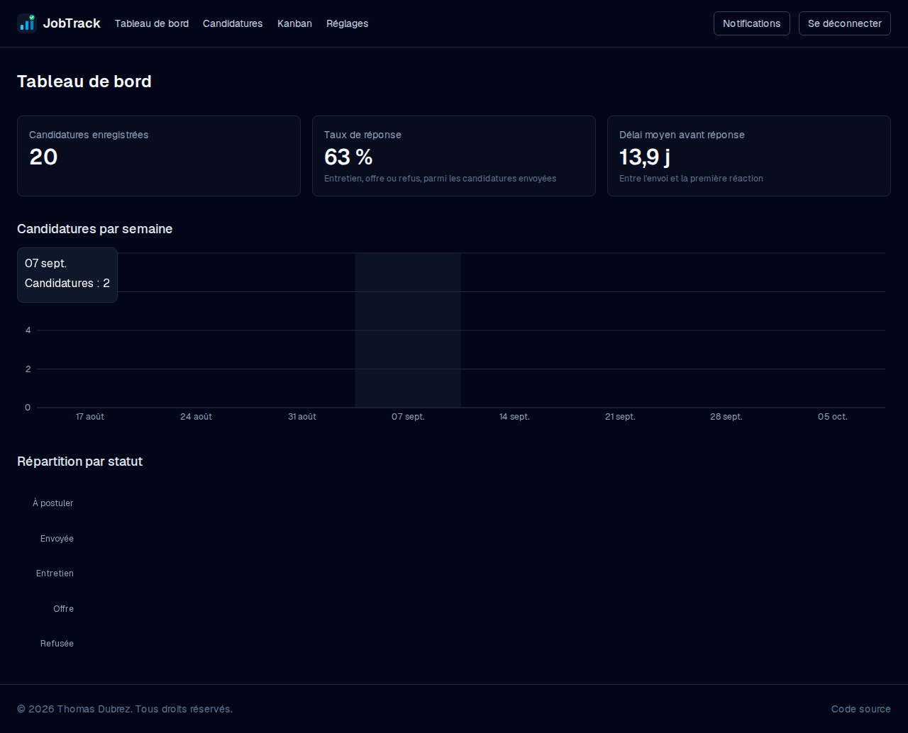
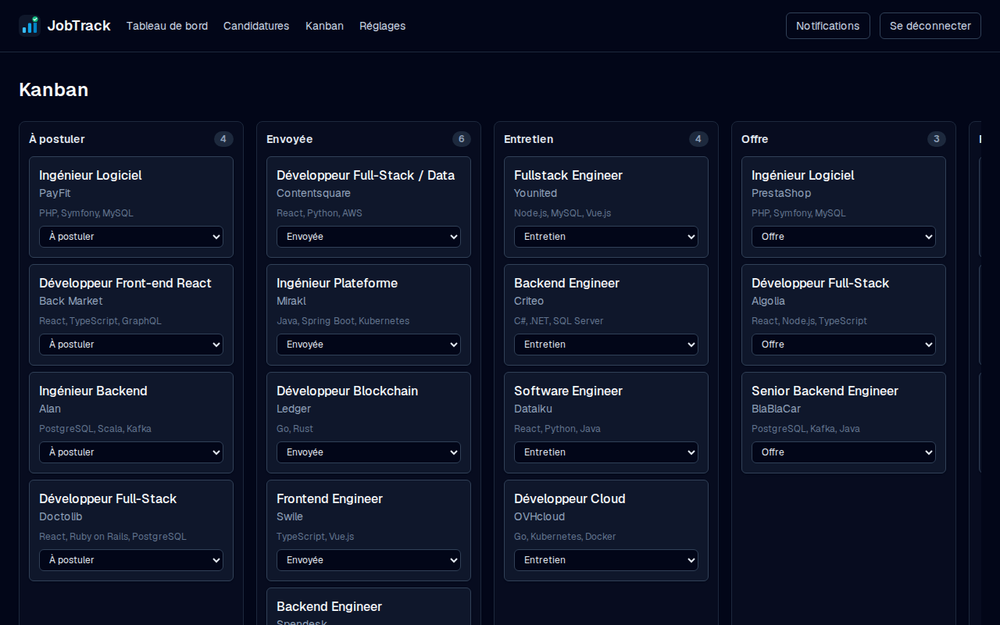
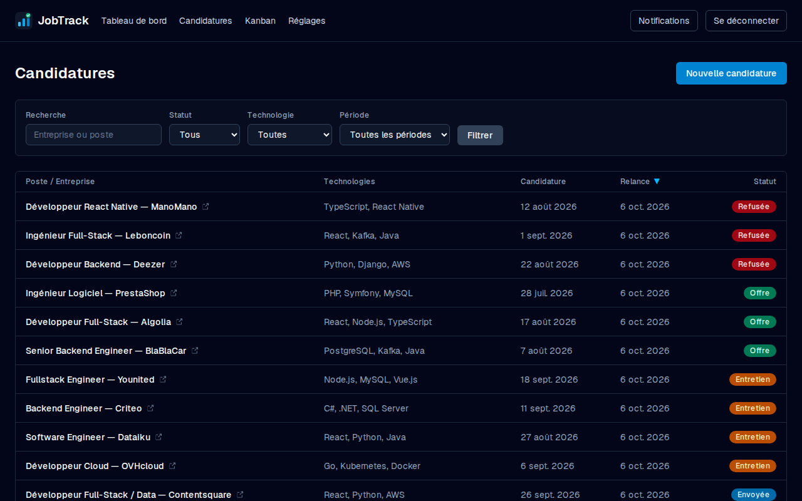
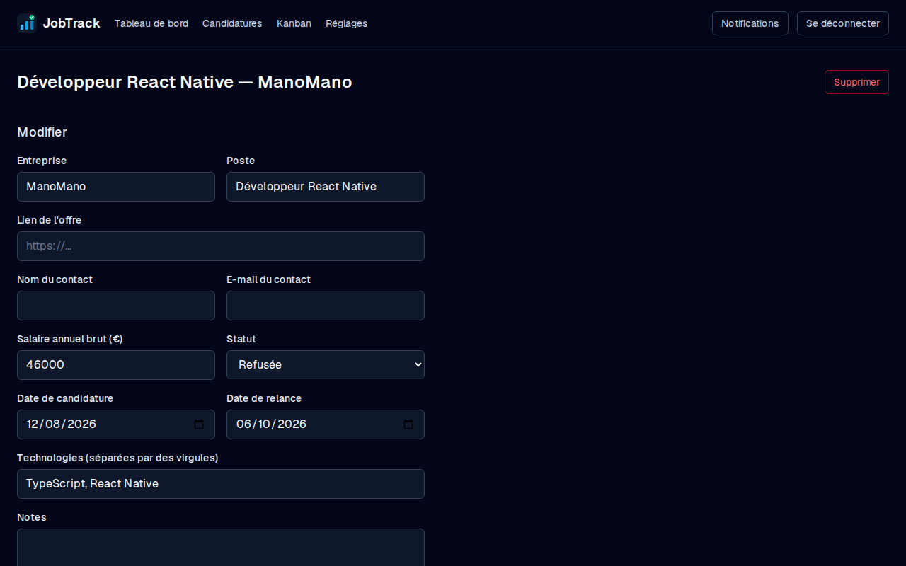
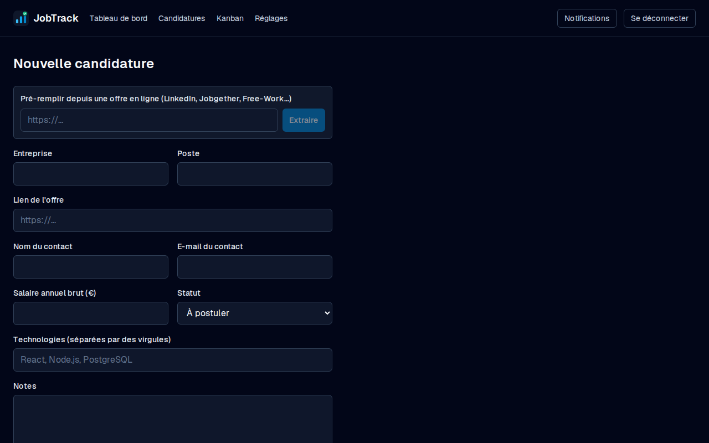
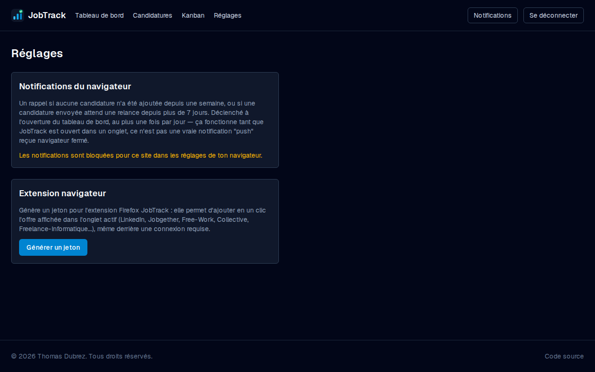

# JobTrack


Application de suivi de candidatures pour chercheurs d'emploi en développement.

<details>
<summary>English summary</summary>

JobTrack is a job-application tracker built with Next.js 16 (App Router), TypeScript, Prisma/MySQL
and Auth.js. It covers the full workflow of a job search: a drag-and-drop Kanban board (5 stages, from
"to apply" to "offer"/"rejected"), automatic status-change history, search and filters, a stats
dashboard (response rate, average time to first reply, weekly volume), and a follow-up reminder system
that flags applications left without news for more than 10 days. Each user only ever sees their own
data, enforced server-side on every query. See the [full write-up](docs/CONCEPTION.md) for the data
model, the technical decisions (and why), and the security choices. A demo account is pre-seeded with
20 realistic applications — see "Compte de démonstration" below, or just hit the demo login button.

</details>

## Le problème

Chercher un emploi génère vite une vingtaine (voire une centaine) de candidatures en parallèle, à des
étapes différentes, avec des contacts, des relances à ne pas oublier et des informations qui se perdent
entre des mails, un tableur et des notes papier. **JobTrack** centralise tout ce suivi dans une seule
interface : un tableau Kanban pour visualiser l'avancement, un historique automatique de chaque
changement de statut, des rappels de relance, et un tableau de bord pour objectiver sa recherche
(taux de réponse, délai moyen avant retour, etc.).

## Fonctionnalités

- **Authentification** par e-mail / mot de passe (inscription, connexion, déconnexion), avec hachage
  bcrypt et isolation stricte des données par utilisateur.
- **Tableau Kanban** avec glisser-déposer entre 5 colonnes : À postuler, Envoyée, Entretien, Offre,
  Refusée.
- **CRUD complet** des candidatures (entreprise, poste, lien de l'offre, salaire, contact, notes,
  technologies) avec une fiche détaillée.
- **Historique automatique** : chaque changement de statut est journalisé et affiché en timeline.
- **Recherche et filtres** par statut, technologie et période.
- **Tableau de bord statistique** : candidatures par semaine, taux de réponse, délai moyen avant
  réponse, répartition par statut (graphiques Recharts).
- **Rappels de relance** : un script planifié détecte les candidatures sans nouvelles depuis plus de
  10 jours et génère une notification dans l'application.
- **Refus automatique après 30 jours** : une candidature "Envoyée" sans le moindre changement de
  statut depuis 30 jours passe automatiquement à "Refusée" (vérifié à chaque navigation dans
  l'app). Exclue du calcul du taux de réponse, pour ne pas le fausser avec de faux "refus".
- **Notifications du navigateur** (opt-in, dans Réglages) : rappel si aucune candidature n'a été
  ajoutée depuis une semaine, ou si une candidature envoyée attend une relance depuis plus de
  7 jours. Via l'API `Notification` du navigateur (fonctionne tant que l'onglet est ouvert, ce
  n'est pas une vraie Web Push reçue navigateur fermé).
- **Pré-remplissage assisté par IA** : colle le lien d'une offre (LinkedIn, Jobgether, Free-Work,
  Collective, Freelance-Informatique...) et un modèle Groq en extrait entreprise, poste, lieu,
  contrat, salaire, technologies et résumé pour pré-remplir le formulaire de création.
- **Extension Firefox** (`extension/`) : ajoute en un clic l'offre affichée dans l'onglet actif,
  y compris sur des pages qui nécessitent une connexion (LinkedIn Jobs...) — l'extension lit le
  texte déjà affiché dans le navigateur plutôt que de refaire une requête serveur qui se
  heurterait au mur de connexion. Voir [`extension/README.md`](extension/README.md).
- **Tableau triable** sur `/applications` : en-têtes de colonnes cliquables (nom, date de
  candidature, date de relance, statut), avec un lien "ouvrir dans un nouvel onglet" sur chaque
  ligne.
- **Compte de démonstration** pré-rempli avec une vingtaine de candidatures réalistes.

## Captures d'écran

| Tableau de bord                                    | Kanban                                         |
| -------------------------------------------------- | ---------------------------------------------- |
|  |  |

| Candidatures (recherche et filtres)                          | Fiche détaillée (historique)                                  |
| ------------------------------------------------------------ | ------------------------------------------------------------- |
|  |  |

| Nouvelle candidature (pré-remplissage IA)                     | Réglages (jeton de l'extension)            |
| ------------------------------------------------------------- | ------------------------------------------ |
|  |  |

## Stack technique

| Domaine            | Choix                                                      |
| ------------------ | ---------------------------------------------------------- |
| Framework          | [Next.js](https://nextjs.org) 16 (App Router) + React 19   |
| Langage            | TypeScript (mode strict, pas de `any`)                     |
| Accès aux données  | [Prisma](https://www.prisma.io) 6 (provider MySQL/MariaDB) |
| Authentification   | [Auth.js](https://authjs.dev) (credentials + bcrypt)       |
| Validation         | [Zod](https://zod.dev)                                     |
| Style              | [Tailwind CSS](https://tailwindcss.com) 4                  |
| Glisser-déposer    | [dnd-kit](https://dndkit.com)                              |
| Graphiques         | [Recharts](https://recharts.org)                           |
| Tests unitaires    | [Vitest](https://vitest.dev)                               |
| Tests bout en bout | [Playwright](https://playwright.dev)                       |
| Qualité de code    | ESLint + Prettier                                          |

Le détail des choix techniques (pourquoi Prisma plutôt que du SQL brut, Server Actions plutôt qu'une
API REST, etc.) est justifié dans [docs/CONCEPTION.md](docs/CONCEPTION.md).

## Installation en local (Linux + XAMPP)

### Prérequis

- [XAMPP](https://www.apachefriends.org) installé dans `/opt/lampp` (fournit MariaDB).
- [Node.js](https://nodejs.org) (géré via [nvm](https://github.com/nvm-sh/nvm) recommandé), version 20+.
- **L'application tourne avec Node.js, pas avec Apache/PHP.** XAMPP ne sert ici qu'à fournir la base
  de données MariaDB.

### 1. Démarrer MariaDB (XAMPP)

```bash
sudo /opt/lampp/lampp startmysql
# ou pour démarrer toute la pile XAMPP :
sudo /opt/lampp/lampp start
```

Vérifier que le service répond :

```bash
/opt/lampp/bin/mysqladmin -u root ping
```

> Si MariaDB renvoie une erreur du type `Column count of mysql.proc is wrong`, les tables système
> doivent être mises à niveau (cas fréquent après une mise à jour de XAMPP) :
> `/opt/lampp/bin/mysql_upgrade -u root -h 127.0.0.1`

### 2. Créer la base de données

Avec phpMyAdmin (`http://localhost/phpmyadmin`), créer une base nommée `jobtrack` avec l'interclassement
`utf8mb4_unicode_ci`.

Ou en ligne de commande :

```bash
/opt/lampp/bin/mysql -h 127.0.0.1 -u root -e \
  "CREATE DATABASE IF NOT EXISTS jobtrack CHARACTER SET utf8mb4 COLLATE utf8mb4_unicode_ci;"
```

### 3. Cloner et installer les dépendances

```bash
git clone git@github.com:thomas-ddev/job-track.git jobtrack
cd jobtrack
npm install
```

### 4. Configurer les variables d'environnement

```bash
cp .env.example .env
```

Le fichier `.env.example` est déjà préconfiguré pour XAMPP (utilisateur `root`, sans mot de passe).

> **Pourquoi `127.0.0.1` et pas `localhost` ?** Avec MySQL/MariaDB, le client interprète `localhost`
> comme une instruction de se connecter via un socket Unix (dont le chemin varie selon
> l'installation), alors que `127.0.0.1` force une connexion TCP classique sur le port 3306. Cela évite
> les erreurs `Can't connect to local MySQL server through socket`.

Générer un secret pour Auth.js et le placer dans `AUTH_SECRET` :

```bash
openssl rand -base64 32
```

Pour le pré-remplissage assisté par IA, renseigner une ou plusieurs clés
[Groq](https://console.groq.com/keys) (gratuites) dans `GROQ_API_KEYS` (séparées par des virgules).
Sans clé, le reste de l'application fonctionne normalement — seul le bouton "Extraire" échoue.

### 5. Appliquer les migrations et générer le client Prisma

```bash
npx prisma migrate dev
```

### 6. Charger le jeu de données de démonstration

```bash
npm run db:seed
```

Crée (ou recrée) le compte de démonstration avec une vingtaine de candidatures réalistes à différents
stades (voir identifiants ci-dessous). Relancer cette commande est sans danger : elle supprime d'abord
l'éventuel compte de démonstration existant avant de le recréer.

### 7. Lancer l'application

```bash
npm run dev
```

L'application est accessible sur [http://localhost:3000](http://localhost:3000).

### Compte de démonstration

| E-mail              | Mot de passe |
| ------------------- | ------------ |
| `demo@jobtrack.dev` | `demo1234`   |

Un bouton "Essayer avec le compte de démonstration" sur la page de connexion remplit et soumet
automatiquement ces identifiants — pas besoin de les recopier.

## Scripts disponibles

```bash
npm run dev           # Serveur de développement
npm run build          # Build de production
npm run start          # Lancer le build de production
npm run lint           # ESLint
npm run typecheck      # Vérification des types TypeScript
npm run format          # Formatage avec Prettier
npm run db:migrate      # Appliquer les migrations Prisma (dev)
npm run db:studio       # Interface graphique Prisma Studio
npm run db:seed         # Créer/recréer le compte de démonstration
npm run reminders       # Détection des candidatures à relancer, génère des notifications
npm run test            # Tests unitaires (Vitest)
npm run test:watch      # Tests unitaires en mode watch
npm run test:e2e        # Test de bout en bout (Playwright)

./scripts/build-extension.sh  # Empaquette extension/ en .xpi (voir extension/README.md)
```

## Structure du projet

```
jobtrack/
├── prisma/
│   ├── schema.prisma        # Modèle de données (source de vérité)
│   ├── migrations/          # Historique des migrations SQL
│   └── seed.ts              # Génère le compte de démonstration
├── src/
│   ├── app/                 # Routes Next.js (App Router : (auth), (app), api)
│   ├── components/          # Composants UI réutilisables, organisés par domaine
│   ├── lib/                 # Logique métier pure, DAL, client Prisma singleton
│   ├── server/
│   │   ├── data/             # Lecture, toujours filtrée par utilisateur
│   │   └── actions/          # Server Actions (mutations)
│   ├── schemas/              # Schémas de validation Zod
│   └── generated/prisma/    # Client Prisma généré (non versionné)
├── scripts/                  # Scripts Node indépendants (ex. rappels de relance)
├── extension/                 # Extension Firefox (ajout d'une offre en un clic)
├── e2e/                       # Test de bout en bout Playwright
├── docs/
│   └── CONCEPTION.md         # Dossier de conception détaillé
├── .github/workflows/         # CI (lint, types, tests)
├── .env.example               # Modèle de configuration
└── README.md
```

## Documentation

- [docs/CONCEPTION.md](docs/CONCEPTION.md) — contexte, choix techniques justifiés, modèle de données,
  sécurité, journal de conception (difficultés rencontrées et comment elles ont été résolues) et pistes
  d'amélioration.

## Qualité et CI

Chaque push déclenche un workflow GitHub Actions (`.github/workflows/ci.yml`) : lint, vérification des
types, tests unitaires, puis un test de bout en bout contre une vraie base MariaDB. Voir
[`npm run test`, `npm run test:e2e`](#scripts-disponibles) pour les lancer en local.

## Auteur

**Thomas Dubrez** — [github.com/thomas-ddev](https://github.com/thomas-ddev)

## Licence

Projet personnel sous licence MIT. Voir [LICENSE](LICENSE).
