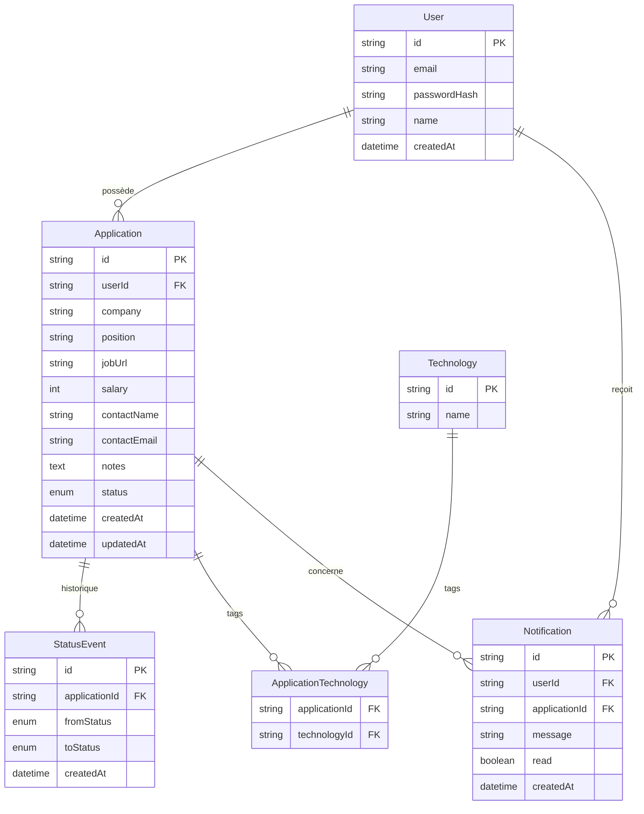

# Dossier de conception — JobTrack

## 1. Contexte et objectifs

JobTrack est née d'un besoin concret : pendant une recherche d'emploi active, le nombre de
candidatures suivies en parallèle dépasse vite ce qu'un tableur permet de gérer sereinement
(relances oubliées, statuts qui ne reflètent plus la réalité, absence de vue d'ensemble). L'objectif
du projet est double :

1. **Fonctionnel** : fournir un outil réellement utilisable pour suivre une recherche d'emploi de bout
   en bout — candidatures, statuts, relances, statistiques.
2. **Pédagogique / portfolio** : démontrer une maîtrise d'une stack moderne full-stack TypeScript
   (Next.js, Prisma, Auth.js) avec un niveau d'exigence professionnel : typage strict, séparation des
   responsabilités, tests, CI, sécurité traitée dès la conception plutôt qu'ajoutée après coup.

Le projet est construit par phases livrables indépendamment, chacune se terminant par un état
fonctionnel vérifiable.

## 2. Étapes de conception

### Phase 1 — Initialisation, configuration, schéma de données

**Ce qui a été fait :**

- Scaffolding Next.js 16 (App Router) avec TypeScript strict, ESLint et Tailwind CSS 4 via
  `create-next-app`.
- Renforcement du typage : activation de `noUncheckedIndexedAccess` dans `tsconfig.json` (un accès à
  un index de tableau ou une clé d'objet non garantie renvoie `T | undefined`, pas `T` — élimine une
  classe d'erreurs silencieuses) et de la règle ESLint
  `@typescript-eslint/no-explicit-any` en erreur bloquante (pas seulement un avertissement), pour que
  l'interdiction du `any` explicite imposée par le cahier des charges soit vérifiée automatiquement,
  pas seulement respectée par discipline.
- Mise en place de Prettier (`prettier-plugin-tailwindcss` pour trier les classes utilitaires dans un
  ordre déterministe) et `eslint-config-prettier` pour éviter les conflits de règles entre ESLint et
  Prettier.
- Installation de Prisma et conception du schéma de données complet (voir section 4), couvrant les
  besoins de toutes les phases à venir — modifier un schéma de base de données en cours de route coûte
  plus cher (migrations, données existantes à adapter) que de bien le penser une fois, même si
  certaines phases ne l'exploiteront que plus tard.
- Création de la base `jobtrack` et première migration (`prisma migrate dev --name init`).
- Mise en place d'un client Prisma singleton (`src/lib/db.ts`) pour éviter l'épuisement des connexions
  MySQL pendant le rechargement à chaud en développement (voir section 5).

**Difficultés rencontrées et résolutions :**

- **Version de Prisma.** Le paquet `prisma` installé par défaut (`npm install prisma`) pointait vers
  une version majeure 8 en _release candidate_, qui a changé en profondeur la configuration : l'URL de
  connexion n'est plus acceptée dans `schema.prisma` et impose un système d'« adapters » de pilote de
  base de données. Une RC n'est pas un choix responsable pour un projet destiné à être lu et noté : la
  stack a été figée sur la dernière version stable de la branche 6 (`6.19.3`), qui garde le modèle
  classique (URL dans `schema.prisma`, CLI autonome) et dispose d'une documentation et d'un support
  communautaire éprouvés.
- **Tables système MariaDB obsolètes.** La première tentative de migration a échoué avec l'erreur
  `Column count of mysql.proc is wrong. Expected 21, found 20.` Cette erreur survient quand le binaire
  du serveur MariaDB a été mis à jour (par une mise à jour de XAMPP) sans que les tables système
  (base `mysql`) ne soient migrées en conséquence. Résolution standard : exécuter
  `mysql_upgrade -u root -h 127.0.0.1`, qui met à niveau les tables système sans toucher aux données
  applicatives.
- **Faux négatif du statut XAMPP.** `/opt/lampp/lampp status` indiquait `MySQL is not running` alors
  que le serveur répondait correctement aux requêtes. En cause : le script de statut de XAMPP lit un
  fichier PID auquel l'utilisateur courant n'a pas les permissions de lecture — un problème
  d'affichage, pas un problème réel d'indisponibilité. Vérifié avec `mysqladmin -u root ping` et
  `ss -tlnp | grep 3306`, qui donnent l'état réel du service indépendamment du script de statut.

### Phase 2 — Authentification

**Ce qui a été fait :**

- Installation d'Auth.js v5 (bêta — seule version compatible App Router ; c'est d'ailleurs la
  bibliothèque citée en premier dans la documentation officielle Next.js pour l'authentification),
  configuré avec un unique provider `Credentials` (e-mail + mot de passe).
- **Pas d'adaptateur Prisma pour Auth.js.** L'adaptateur fournit des tables `Account`, `Session` et
  `VerificationToken` pensées pour des fournisseurs OAuth et des sessions persistées en base. Sans
  fournisseur externe, le modèle `User` de l'application sert déjà de source de vérité ; la session
  utilise une stratégie JWT stateless (signée avec `AUTH_SECRET`, sans aucune table de session).
- Mots de passe hachés avec `bcryptjs` (facteur de coût 12) dans la Server Action d'inscription,
  jamais stockés ni journalisés en clair.
- **Validation Zod côté serveur** (`src/schemas/auth.ts`) : les Server Actions revalident les champs
  reçus avec les mêmes schémas que les formulaires, indépendamment de toute validation côté client.
- **Data Access Layer** (`src/lib/dal.ts`) : point d'entrée unique pour vérifier la session côté
  serveur (`verifySession()` redirige vers `/login` si absente, `getOptionalSession()` pour l'affichage
  conditionnel). Toutes les pages et Server Actions protégées passent par cette fonction plutôt que
  d'appeler `auth()` directement — un seul endroit où la règle de redirection est définie.
- Pages `/login` et `/register` (formulaires client avec `useActionState` pour afficher les erreurs de
  validation et l'état de soumission sans JavaScript personnalisé), zone protégée `(app)` avec layout
  commun qui appelle `verifySession()` une seule fois pour tout le groupe de routes.
- `src/proxy.ts` : redirection _optimiste_ (lecture du JWT, sans requête base de données) pour les
  routes protégées — une amélioration de confort, pas la protection de sécurité principale (voir
  détail dans la section Sécurité).

**Difficultés rencontrées et résolutions :**

- **`middleware.ts` → `proxy.ts`.** Next.js 16 a renommé le fichier `middleware.ts` en `proxy.ts` (et
  la fonction exportée `middleware` en `proxy`) ; l'ancien nom est encore accepté mais déprécié. La
  documentation embarquée dans le paquet `next` installé a été consultée directement
  (`node_modules/next/dist/docs`) pour confirmer la nouvelle convention avant d'écrire le code, plutôt
  que de s'appuyer sur une convention plus ancienne.
- **Fuite de Prisma dans le bundle du Proxy.** Un premier build a généré un avertissement Turbopack :
  le Proxy embarquait tout le client Prisma (et son code de détection d'OpenSSL, qui fait un accès
  disque non borné) simplement parce qu'il importait `auth()` depuis `src/auth.ts`, qui importait à son
  tour Prisma pour le provider Credentials. Résolu en séparant la configuration Auth.js en deux
  fichiers : `src/auth.config.ts` (callbacks et stratégie de session, sans provider) utilisé par le
  Proxy pour décoder le JWT, et `src/auth.ts` (configuration complète avec le provider Credentials,
  Prisma et bcrypt) utilisé uniquement par les Server Actions et la route handler. Le Proxy n'a ainsi
  plus aucune dépendance vers la base de données.
- **Tests manuels du flux d'authentification.** Plutôt que de supposer que les Server Actions et les
  routes d'Auth.js fonctionnaient, le flux complet a été vérifié via des requêtes HTTP directes
  (`curl`) : récupération du jeton CSRF, connexion via
  `/api/auth/callback/credentials`, vérification du cookie de session, accès à `/dashboard`, rejet d'un
  mauvais mot de passe (`error=CredentialsSignin`), déconnexion via `/api/auth/signout` et nouvelle
  redirection vers `/login`. Un utilisateur de test a été créé puis supprimé directement en base pour
  cette vérification.

### Phase 3 — CRUD des candidatures, fiche détaillée, historique

**Ce qui a été fait :**

- Séparation nette entre lecture et écriture : `src/server/data/applications.ts` (requêtes, toujours
  filtrées par `userId`) et `src/server/actions/applications.ts` (Server Actions de mutation). Les
  schémas de validation vivent dans `src/schemas/application.ts`, indépendants des deux.
- **CRUD complet** : création, modification et suppression de candidature, formulaire unique
  (`ApplicationForm`) réutilisé entre `/applications/new` (création) et `/applications/[id]`
  (édition) via une prop `mode`.
- **Technologies en relation N—N** : saisies comme une chaîne séparée par des virgules côté formulaire,
  normalisées et dédupliquées (insensible à la casse) côté serveur, puis associées par `upsert` sur
  `Technology.name` pour éviter les doublons ("React" / "react").
- **Historique automatique** : chaque création génère un premier `StatusEvent` (`fromStatus: null`),
  chaque modification qui change le statut en génère un second (`fromStatus` = ancien statut,
  `toStatus` = nouveau). La comparaison se fait côté serveur, sur l'état **avant** la modification, pas
  sur une valeur déduite du formulaire — un utilisateur ne peut pas falsifier l'historique en soumettant
  un `fromStatus` arbitraire puisque ce champ n'est même pas exposé au client.
- **Vérification de propriété sur toutes les mutations** : `updateApplicationAction` et
  `deleteApplicationAction` relisent la candidature par son `id` et vérifient que `userId` correspond à
  la session avant toute écriture — l'identifiant transmis dans le formulaire n'est jamais traité comme
  fiable. La fiche détaillée utilise la même logique en lecture (`getApplicationForUser`) : une
  candidature d'un autre utilisateur ne "existe pas" du point de vue de la requête SQL, et se traduit
  par un 404, pas par un message d'erreur qui révélerait qu'un identifiant valide a été deviné.
- **États gérés** : liste vide ("Aucune candidature enregistrée"), et formulaires qui réaffichent les
  erreurs de validation Zod sans perdre les valeurs déjà saisies (grâce à `defaultValue` plutôt qu'un
  état contrôlé, combiné à `useActionState`).

**Difficultés rencontrées et résolutions :**

- **Typage de `z.coerce.number()` après un `.transform()`.** Chaîner `.pipe(z.coerce.number()...)`
  après un `.transform()` qui change le type d'entrée en `string | undefined` provoque une erreur de
  type en Zod 4 (le type d'entrée de `ZodCoercedNumber` ne correspond pas exactement au type de sortie
  du transform précédent). Résolu en validant le format par expression régulière
  (`/^\d+$/`) puis en convertissant avec `Number()` dans un second `.transform()`, sans passer par
  `coerce`.
- **Test du flux CRUD sans navigateur.** Les Server Actions liées à un `<form action={fn}>` fonctionnent
  nativement sans JavaScript (progressive enhancement) : Next.js encode la référence de l'action dans
  des champs cachés (`$ACTION_ID_*`, `$ACTION_KEY`, etc.) et traite une simple requête
  `POST multipart/form-data` vers l'URL courante. Cela a permis de vérifier tout le parcours
  (création, changement de statut avec historique, isolation entre deux comptes, suppression en
  cascade) directement en `curl`, sans dépendre d'un navigateur ou d'un framework de test E2E à ce
  stade du projet.

### Phase 4 — Kanban avec glisser-déposer

**Ce qui a été fait :**

- Tableau Kanban (`/kanban`) construit avec **dnd-kit** : une colonne par statut
  (`KanbanColumn`, zone `useDroppable`), une carte par candidature (`KanbanCard`, élément
  `useDraggable`). Le glisser-déposer appelle la **même** Server Action que le changement de statut
  manuel sur la fiche détaillée (`changeApplicationStatusAction`, écrite en phase 3) : aucune logique
  métier dupliquée entre les deux interfaces.
- **Mise à jour optimiste avec annulation** : le déplacement d'une carte met à jour l'état local
  React immédiatement (retour visuel instantané), puis persiste en base de façon asynchrone. Si la
  Server Action échoue (candidature supprimée entre-temps, session expirée), la carte revient
  automatiquement à sa colonne d'origine et un message d'erreur s'affiche — l'interface ne doit jamais
  laisser croire qu'un changement a été enregistré s'il ne l'a pas été.
- **Alternative accessible au glisser-déposer** : chaque carte expose aussi un `<select>` natif pour
  changer de statut au clavier ou avec un lecteur d'écran. Le glisser-déposer à la souris reste
  possible au clavier via le `KeyboardSensor` de dnd-kit, mais un `<select>` standard est plus robuste
  et plus simple à utiliser qu'un drag au clavier, pour un coût d'implémentation minime — les deux
  chemins appellent la même fonction `moveCard`.
- Historique inchangé : un déplacement Kanban crée un `StatusEvent` exactement comme une modification
  via le formulaire, puisque c'est la même Server Action qui est invoquée.

**Difficultés rencontrées et résolutions :**

- **Tester un glisser-déposer réel sans dépendance de projet prématurée.** Playwright est prévu pour
  les tests E2E en phase 7, mais vérifier qu'un vrai glisser-déposer à la souris fonctionne (et pas
  seulement l'alternative `<select>`) nécessitait un navigateur piloté. Plutôt que d'ajouter Playwright
  comme dépendance du projet en avance de phase, un script Node ponctuel a installé `playwright-core`
  avec `npm install --no-save` (aucune modification de `package.json`), simulé une séquence réelle
  d'événements souris (`mousedown` → `mousemove` → `mouseup`) sur la poignée d'une carte jusqu'à la
  colonne « Entretien », vérifié en base que le statut et l'historique étaient à jour, puis désinstallé
  le paquet. Le dépôt reste donc inchangé tant que la phase 7 n'introduit pas officiellement
  Playwright.
- **Calcul de l'état précédent dans un `setState`.** Une première version calculait la colonne
  d'origine d'une carte _à l'intérieur_ du callback passé à `setColumns`, en s'appuyant sur l'exécution
  synchrone de ce callback pour en extraire une valeur utilisée ensuite hors de `setState` — un détail
  d'implémentation de React sur lequel il ne faut pas compter. Corrigé en lisant l'état `columns` du
  rendu en cours (déjà disponible via la fermeture) pour déterminer la colonne de départ _avant_
  d'appeler `setColumns`, qui ne fait plus ensuite qu'appliquer une transformation pure.

### Phase 5 — Recherche, filtres et tableau de bord statistique

**Ce qui a été fait :**

- **Recherche et filtres** (`/applications`) sur le statut, la technologie et une période glissante
  (7 / 30 / 90 jours / toutes), combinés à une recherche texte sur l'entreprise ou le poste. Implémentés
  comme un formulaire `GET` natif plutôt qu'un composant client avec `fetch` : les filtres vivent dans
  l'URL (partageable, navigable avec le bouton "retour" du navigateur), et la page fonctionne sans
  JavaScript — cohérent avec le choix déjà fait pour les Server Actions en phase 3.
- **Séparation calcul / accès aux données pour les statistiques** : `src/lib/stats.ts` contient des
  fonctions **pures** (`computeWeeklyApplicationCounts`, `computeResponseRate`,
  `computeAverageResponseDelayDays`, `computeStatusBreakdown`) qui ne dépendent ni de Prisma ni de
  Next.js — seulement des tableaux de dates/statuts en entrée. `src/server/data/stats.ts` se contente
  de récupérer les données scopées par `userId` et de les passer à ces fonctions. Cette séparation est
  pensée dès maintenant pour la phase 7 : ces fonctions sont testables unitairement sans simuler la
  base de données.
- **Définitions métier explicites** :
  - _Taux de réponse_ = part des candidatures **envoyées** (donc hors "À postuler") ayant obtenu une
    réaction (entretien, offre ou refus). Retourne `null` (affiché "—") plutôt que 0 % quand aucune
    candidature n'a encore été envoyée — l'absence de données n'est pas un taux de zéro.
  - _Délai moyen avant réponse_ = écart moyen, en jours, entre l'événement d'historique marquant
    l'envoi (`toStatus = APPLIED`) et le premier événement suivant marquant une réaction, par
    candidature. Calculé à partir des `StatusEvent` plutôt que d'un champ dédié : la donnée existe déjà
    dans l'historique de la phase 3, pas besoin de la dupliquer.
- **Graphiques Recharts** conformes à la méthodologie de la skill dataviz du projet : palette
  catégorielle validée par script (séparation CVD, bande de luminosité, contraste — voir ci-dessous),
  jamais une couleur choisie à l'œil ; axes discrets, grille en traits fins, étiquettes de valeur
  directement sur les barres plutôt qu'une légende séparée quand l'axe nomme déjà chaque catégorie.
- **Statuts initialisés à zéro** dans la répartition et les semaines sans activité : un statut ou une
  semaine sans aucune candidature apparaît avec un compte de 0 plutôt que d'être absent du graphique —
  un graphique ne doit pas sauter silencieusement une catégorie ou une période.

**Difficultés rencontrées et résolutions :**

- **Validation de la palette du graphique de répartition par statut.** Une première tentative a
  réutilisé les couleurs Tailwind déjà utilisées pour les badges de statut ailleurs dans l'UI
  (sky/amber/emerald/red/slate). Passées au script de validation de la skill dataviz contre la surface
  sombre du tableau de bord, elles échouaient sur plusieurs critères (bande de luminosité, plancher de
  chroma, séparation CVD insuffisante entre deux teintes adjacentes). Remplacées par la palette
  catégorielle par défaut de la skill (bleu/vert/magenta/jaune/aqua, étapes "dark"), validée par
  `scripts/validate_palette.js` contre la surface `#020617` : tous les critères passent, avec un couple
  adjacent dans la zone 6–8 de séparation CVD (jaune/aqua) qui impose un encodage secondaire — chaque
  barre porte déjà le nom du statut sur l'axe, ce qui satisfait cette exigence sans légende
  supplémentaire. Les badges de statut ailleurs dans l'UI gardent leurs couleurs Tailwind : ce sont des
  puces de texte à fort contraste, pas un graphique où l'identité doit être discriminée uniquement par
  la teinte.
- **Faux positif sur une capture d'écran "pleine page".** Un test au navigateur a d'abord semblé
  montrer des graphiques vides (aucune barre visible) sur une capture `fullPage: true`. Une capture de
  l'élément SVG seul, puis une capture du viewport sans l'option `fullPage`, ont montré des graphiques
  parfaitement rendus — confirmé en inspectant le DOM (les `<path>` des barres étaient bien présents,
  avec la bonne couleur et une opacité de 1). La capture "pleine page" de Chromium headless assemble
  plusieurs captures par défilement, ce qui interagit mal avec les bibliothèques basées sur
  `ResizeObserver` comme Recharts. Un faux problème qu'il valait la peine de vérifier avant de modifier
  du code qui fonctionnait déjà.
- **Chiffres vérifiés manuellement.** Un jeu de données de test construit avec des délais connus à
  l'avance (candidatures envoyées puis ayant reçu une réponse après un nombre de jours fixé) a permis de
  vérifier que le taux de réponse (75 %) et le délai moyen (9 jours) affichés correspondaient
  exactement au calcul attendu à la main, pas seulement à un nombre plausible.

### Phase 6 — Script de relances et notifications

**Ce qui a été fait :**

- **Logique de détection pure** (`src/lib/reminders.ts`) : `needsReminder()` et
  `selectApplicationsNeedingReminder()` ne dépendent ni de Prisma ni de l'heure système (elles reçoivent
  `now` en paramètre) — même approche que `src/lib/stats.ts` en phase 5, pour que cette logique soit
  testable unitairement en phase 7 sans horloge ni base de données simulées. Une candidature doit être
  relancée si elle est toujours au statut "Envoyée" et que son **dernier passage** à ce statut date de
  plus de `REMINDER_THRESHOLD_DAYS` (10) jours.
- **Date de référence tirée de l'historique, pas d'un champ dédié** : le délai se mesure depuis le
  dernier `StatusEvent` dont `toStatus = APPLIED`, pas depuis `Application.updatedAt`. La distinction
  compte : `updatedAt` change aussi quand on modifie une note ou un contact sans changer de statut, ce
  qui aurait repoussé une relance à tort. Réutiliser l'historique de la phase 3 évite aussi de dupliquer
  une donnée qui existe déjà.
- **Script Node autonome** (`scripts/reminders.ts`, lancé via `npm run reminders`) : récupère toutes les
  candidatures "Envoyée" tous utilisateurs confondus (ce script n'est pas une requête d'un utilisateur
  particulier, donc pas de `verifySession()` ici — il est destiné à être exécuté hors requête HTTP, par
  une tâche planifiée type cron), calcule la date de dernier passage à "Envoyée" par candidature, puis
  crée une `Notification` pour chacune dépassant le seuil.
- **Idempotence entre deux exécutions** : avant de créer une notification, le script vérifie qu'aucune
  n'existe déjà pour cette candidature depuis son dernier passage à "Envoyée"
  (`Notification.createdAt >= lastAppliedAt`). Un script relancé quotidiennement (cron) ne doit pas
  créer une nouvelle notification à chaque exécution tant que rien n'a changé ; si la candidature quitte
  puis revient au statut "Envoyée", la fenêtre de déduplication repart naturellement à zéro puisqu'elle
  est ancrée sur le `StatusEvent` le plus récent.
- **Notifications in-app** : `src/server/data/notifications.ts` (lecture scopée par `userId`, comme
  toutes les données de l'application) et `src/server/actions/notifications.ts`
  (`markNotificationReadAction`, `markAllNotificationsReadAction`, avec la même vérification de
  propriété que les autres Server Actions). Affichées via `NotificationBell`
  (`src/components/notifications/notification-bell.tsx`), un composant **serveur** : le menu déroulant
  est un `
/
` HTML natif plutôt qu'un composant client avec un `useState` pour
  l'ouverture/fermeture — accessible au clavier et au lecteur d'écran sans JavaScript, cohérent avec le
  choix déjà fait pour les formulaires en progressive enhancement des phases précédentes.

**Difficultés rencontrées et résolutions :**

- **`.env` non chargé par un script Node autonome.** Contrairement à Next.js, qui charge `.env`
  automatiquement, un script lancé directement avec `tsx` ne lit pas ce fichier. Plutôt qu'ajouter une
  dépendance (`dotenv`) ou charger le fichier manuellement en code, le script npm utilise le flag natif
  de Node 20.6+ : `tsx --env-file=.env scripts/reminders.ts`. Aucune dépendance supplémentaire, et le
  comportement est identique à celui d'un vrai déploiement cron qui recevrait les variables
  d'environnement autrement.
- **Validation de la déduplication par un scénario construit à la main.** Un utilisateur, une
  candidature "Envoyée" avec un `StatusEvent` daté de 15 jours dans le passé, et deux exécutions
  successives du script ont permis de vérifier que la première crée bien la notification et que la
  seconde ne la duplique pas (`0 notification(s) créée(s)` en sortie), avant suppression des données de
  test. Cette vérification manuelle couvre un cas que les futurs tests unitaires de phase 7 ne pourront
  pas entièrement remplacer : l'idempotence dépend de l'état de la base, pas seulement de la fonction
  pure `needsReminder()`.

### Phase 7 — Seed du compte démo, tests, CI

**Ce qui a été fait :**

- **Seed du compte de démonstration** (`prisma/seed.ts`, lancé via `npm run db:seed`, ou
  `npx prisma db seed` grâce à la clé `"prisma": { "seed": ... }` de `package.json`) : crée
  `demo@jobtrack.dev` / `demo1234` avec vingt candidatures à des stades variés (4 "À postuler", 6
  "Envoyée", 4 "Entretien", 3 "Offre", 3 "Refusée"), auprès d'entreprises et pour des postes réalistes du
  marché tech français. **Idempotent** comme le script de relance : il supprime d'abord l'éventuel compte
  de démonstration existant (la cascade `onDelete: Cascade` nettoie candidatures, événements et
  notifications en même temps) avant de le recréer, pour qu'il soit possible de relancer la commande sans
  accumuler de doublons.
- **Historique antidaté plutôt qu'un simple champ de statut** : chaque candidature du seed est définie
  par une `timeline` (liste d'étapes `{ status, daysAgo }`) à partir de laquelle le script crée à la fois
  l'`Application` (avec `createdAt`/`updatedAt` positionnés sur la première/dernière étape) et la série de
  `StatusEvent` correspondante, avec des `createdAt` explicites dans le passé. Cette donnée n'est pas
  cosmétique : c'est elle qui alimente le tableau de bord (taux de réponse, délai moyen, répartition par
  semaine) et le script de relance avec des données cohérentes et vérifiables, plutôt que vingt
  candidatures identiques créées au même instant.
- **Tests unitaires (Vitest)** sur `src/lib/stats.ts` et `src/lib/reminders.ts` — 17 tests au total,
  aucun ne touchant Prisma ni une base de données, cohérent avec le soin pris dès la phase 5 à garder
  cette logique pure. Couvrent notamment les cas limites documentés dans le code au moment de leur
  écriture : semaine sans aucune candidature, taux de réponse `null` avant tout envoi, délai ignorant un
  événement antérieur à l'envoi, seuil de relance atteint exactement au jour J.
- **Test de bout en bout (Playwright)** du parcours critique : connexion → création d'une candidature →
  déplacement dans le Kanban (`e2e/kanban-flow.spec.ts`). Un `globalSetup` (`e2e/global-setup.ts`) crée un
  compte dédié directement en base (par Prisma, pas via le formulaire d'inscription : le test cible le
  parcours Kanban, pas l'inscription, et rester indépendant du formulaire d'inscription évite un échec en
  cascade si celui-ci régresse) ; un `globalTeardown` le supprime à la fin. Le déplacement Kanban est
  déclenché via le `<select>` accessible de la carte plutôt qu'un glisser-déposer simulé à la souris —
  cette alternative avait justement été construite en phase 4 pour l'accessibilité, et elle se trouve être
  aussi le moyen le plus fiable de déclencher ce changement dans un test automatisé, puisqu'elle appelle
  la même Server Action que le drag-and-drop.
- **Workflow GitHub Actions** (`.github/workflows/ci.yml`), deux jobs : `quality` (lint, vérification des
  types, tests unitaires — rapide, sans base de données) et `e2e` (service MariaDB éphémère, migrations,
  installation des navigateurs Playwright, test de bout en bout). Séparés plutôt qu'un seul job
  séquentiel : `quality` échoue en quelques secondes sur une erreur de lint ou de typage, pas la peine
  d'attendre qu'un service de base de données démarre pour l'apprendre.

**Difficultés rencontrées et résolutions :**

- **Version de Vitest contrainte par `@types/node`.** La dernière version majeure de Vitest (5) exige
  `@types/node` en version 22 ou supérieure comme peer dependency, alors que le projet est resté sur
  `@types/node@^20` (aligné sur la version de Node historiquement utilisée). Plutôt que de monter
  `@types/node` — un changement qui dépasse le périmètre de cette phase — la version majeure précédente de
  Vitest (3.x, toujours activement maintenue) a été installée : elle accepte explicitement
  `@types/node@^18 || ^20 || >=22`.
- **Test Kanban intermittent à cause de l'hydratation React.** Le premier test E2E écrit échouait un run
  sur deux, de façon silencieuse : après le déplacement d'une carte, un rechargement de la page montrait
  la candidature revenue à son statut d'origine, sans message d'erreur exploitable (le seul `[role=alert]`
  trouvé provenait en réalité d'un élément à vide du panneau de développement Next.js, un faux indice qui
  a fait perdre du temps avant d'être écarté par une inspection du DOM complet). La cause réelle :
  `KanbanBoard` est rendu côté serveur (le HTML du `<select>` existe dès la réponse), mais son
  gestionnaire `onChange` n'est attaché qu'après l'hydratation React côté client. Playwright, qui considère
  un élément "actionnable" dès qu'il est visible et activé dans le DOM, pouvait appeler `selectOption`
  avant la fin de cette hydratation : la valeur du `<select>` changeait visuellement, sans que React — et
  donc la Server Action — n'en soit jamais informé. Résolu en attendant `networkidle` après la navigation
  vers `/kanban`, avant toute interaction avec la page. Vérifié par cinq exécutions consécutives du test
  sans échec après correction (contre un échec silencieux sur deux auparavant).
- **Isolation des données de test par rapport aux données de développement.** Les tests E2E tournent
  potentiellement contre la même base MariaDB que le développement local. Le compte de test
  (`e2e-test@jobtrack.dev`) et ses candidatures sont donc toujours nettoyés par `globalTeardown`, et un
  nettoyage manuel équivalent a été appliqué après chaque session de débogage ponctuelle (scripts
  temporaires exécutés hors suite de tests) pour ne laisser aucune donnée de test orpheline en base.
- **Plantage intermittent du serveur de développement pendant les tests E2E**, indépendant du code de
  l'application : le process `next dev` mourait parfois en cours de test avec
  `turbo-tasks: an internal panic occurred outside the per-task panic boundary`, un bug interne de
  Turbopack (toujours marqué expérimental pour le mode développement) déclenché par les recompilations à
  la volée au fil des navigations du test. Comme `playwright.config.ts` démarre le serveur avec
  `npm run dev` par défaut, ce risque existait aussi en CI. Résolu en servant un **build de production**
  (`next build && next start`) pour les tests E2E lancés en CI (`process.env.CI`), qui ne recompile rien
  à la volée et n'est donc pas exposé à cette classe de plantage ; en local, `next dev` reste utilisé par
  défaut pour la rapidité d'itération.

### Phase 8 — Finitions UI et documentation finale

**Ce qui a été fait :**

- **Nettoyage des restes du scaffold `create-next-app`** : la métadonnée racine (`src/app/layout.tsx`)
  affichait encore le titre et la description par défaut ("Create Next App" / "Generated by create next
  app") sur toute page sans métadonnée propre — y compris la page d'accueil publique, la première que
  verrait un visiteur. Remplacée par un titre et une description réels, `lang="fr"` sur `<html>` (le
  contenu est en français, pas en anglais). `globals.css` définissait aussi des tokens `--background` /
  `--foreground` couplés à `prefers-color-scheme: dark`, jamais utilisés nulle part dans l'application
  (qui pose ses couleurs directement en classes Tailwind `bg-slate-950` etc.) : supprimés, avec un
  commentaire explicite sur le choix d'un thème sombre fixe plutôt qu'une bascule claire/sombre.
- **Bug de responsive découvert par capture d'écran, pas par relecture de code** : une capture de
  l'en-tête de l'application à 375px de large (format mobile) a montré les liens de navigation et les
  actions (notifications, déconnexion) coupés hors de l'écran, invisibles et inatteignables — le header
  utilisait `flex items-center justify-between` sans point de rupture, ce qui fonctionne en largeur
  desktop mais déborde silencieusement en dessous. Corrigé en basculant le header en colonne
  (`flex-col`) sous le point de rupture `sm:`, pour que la navigation et les actions passent à la ligne
  plutôt que de sortir du viewport. Un défaut de ce type n'apparaît dans aucun test automatisé (lint,
  types, tests unitaires, E2E en résolution desktop) : seule une capture à une largeur mobile réelle l'a
  révélé, ce qui a confirmé l'intérêt de vérifier visuellement l'interface à plusieurs tailles d'écran
  avant de considérer le travail de responsive terminé.
- **Second défaut de responsive, plus subtil** : une fois le header corrigé, les pastilles de statut
  (`StatusBadge`) de la liste des candidatures s'étiraient sur toute la largeur de l'écran en mobile,
  perdant leur forme de pastille. Cause : le conteneur passait de `flex-row` (desktop) à `flex-col`
  (mobile) sans valeur explicite pour `align-items`, et la valeur par défaut (`stretch`) étire les
  éléments enfants sur l'axe transversal — qui devient la largeur en mode colonne. Corrigé en fixant
  `items-start` par défaut, explicitement remplacé par `sm:items-center` au-delà du point de rupture.
- **États de chargement et d'erreur au niveau des segments de route** : ajout de `loading.tsx` (squelette
  animé, `role="status"` avec texte en `sr-only` pour les lecteurs d'écran) et `error.tsx` (bouton
  "Réessayer" qui appelle `reset()`) pour le groupe `(app)`, qui couvrent désormais toutes les pages
  protégées sans configuration par route. Jusqu'ici, les états de chargement et d'erreur n'étaient gérés
  qu'au niveau de chaque page individuellement (listes vides, erreurs de formulaire) ; ces deux fichiers
  couvrent le cas où le rendu serveur lui-même est lent (streaming Next.js, écran de chargement pendant
  qu'une requête Prisma répond) ou échoue (erreur non gérée), plutôt que de laisser un écran blanc.
- **Page 404 dédiée** (`src/app/not-found.tsx`) à la place de la page générique de Next.js, cohérente
  avec le reste de l'identité visuelle de l'application. Réutilisée aussi bien pour une route inexistante
  que pour `notFound()` appelé depuis la fiche candidature (phase 3) quand une candidature n'appartient
  pas à l'utilisateur courant — dans les deux cas, le visiteur ne doit pas pouvoir distinguer "cette
  ressource n'existe pas" de "vous n'y avez pas accès" (détail de sécurité déjà présent depuis la phase
  3, maintenant visuellement cohérent avec le reste du produit).
- **Captures d'écran réelles pour le README**, prises contre un build de production (`npm run build` +
  `npm run start`) plutôt qu'en développement : le serveur de développement de Next.js superpose un
  panneau d'outils (icône flottante, badges d'erreurs) qui n'a pas sa place dans des captures destinées à
  un portfolio. Connecté au compte de démonstration, quatre pages capturées à une résolution desktop
  (tableau de bord, Kanban, liste de candidatures avec filtres, fiche détaillée avec historique complet)
  et la page de connexion, intégrées dans le README sous forme de tableau à deux colonnes.

**Difficultés rencontrées et résolutions :**

- **Script de capture ayant ciblé le mauvais lien.** Le premier essai de capture de la fiche candidature
  utilisait le sélecteur `a[href^="/applications/"]` pour cliquer sur la première candidature de la
  liste — qui a en réalité capturé le bouton "Nouvelle candidature" (`href="/applications/new"`),
  présent plus haut dans le DOM et correspondant tout autant à ce sélecteur. Corrigé en restreignant le
  sélecteur à l'intérieur de la liste (`ul a[href^="/applications/"]`), puis en ciblant explicitement une
  candidature au parcours complet (par son nom d'entreprise) pour que la capture illustre une timeline à
  plusieurs événements plutôt qu'une candidature tout juste créée.
- **Le correctif `networkidle` de la phase 7 s'est révélé insuffisant à l'usage.** Une fois d'autres
  pages modifiées (ajout d'un footer, d'un bouton de connexion rapide sur `/login`), le test Kanban a
  recommencé à échouer par intermittence — `networkidle` indique que le réseau est calme, pas que
  l'hydratation React d'un composant client est terminée, et les deux peuvent diverger (en particulier
  avec la compilation à la demande de Turbopack en développement). Remplacé par un signal déterministe :
  `KanbanBoard` expose un indicateur `data-hydrated` dérivé avec `useSyncExternalStore` (valeur serveur
  `false`, valeur client `true` — le pattern documenté par React pour ce cas précis), que le test attend
  explicitement avant d'interagir avec les `<select>` de statut. Une première version utilisait
  `useEffect(() => setIsHydrated(true), [])`, plus intuitive mais signalée par
  `eslint-plugin-react-hooks` (règle `set-state-in-effect`) comme un anti-pattern pouvant provoquer des
  rendus en cascade ; `useSyncExternalStore` est la solution que React recommande pour exposer un état
  "suis-je monté côté client" sans cet inconvénient. Vérifié par une quinzaine d'exécutions consécutives
  du test sans échec après correction.

### Mise à jour — présentation portfolio

Une fois les huit phases terminées, quelques ajouts ciblés pour que le projet se présente comme un
produit fini plutôt que comme un exercice guidé par phases :

- **Pied de page** (`src/components/layout/site-footer.tsx`) avec copyright et lien vers le dépôt,
  affiché sur toutes les pages (publiques et protégées) via les layouts respectifs.
- **Connexion rapide avec le compte de démonstration** : un bouton sur `/login` remplit et soumet le
  formulaire avec les identifiants de démonstration (`src/lib/demo-account.ts`, source unique partagée
  avec `prisma/seed.ts`), pour qu'un visiteur puisse explorer l'application sans chercher les
  identifiants dans le README.
- **Page d'accueil enrichie** d'une courte mise en avant des fonctionnalités (Kanban, historique,
  statistiques, relances), plutôt qu'un simple écran de redirection vers la connexion.
- **`package.json`** complété (auteur, licence, dépôt) et fichier `LICENSE` (MIT) ajoutés — un dépôt
  sans licence ni métadonnées d'auteur est un signe classique de projet d'exercice non finalisé.
- **README** débarrassé de la numérotation par "phase" (qui a sa place dans ce document de conception,
  pensé comme un journal, mais pas dans la vitrine du projet) et complété d'un résumé en anglais.

## 3. Modèle de données

**Explication des relations :**

- **`User` → `Application` (1 — N)** : chaque candidature appartient à un seul utilisateur. C'est la
  relation qui porte toute l'isolation des données : chaque requête serveur doit filtrer par
  `userId` pour qu'un utilisateur ne puisse jamais voir ou modifier les candidatures d'un autre
  (détaillé en section 5).
- **`Application` → `StatusEvent` (1 — N)** : l'historique n'est pas stocké comme un simple champ
  « dernier changement », mais comme une table d'événements append-only. Cela permet d'afficher une
  timeline complète sur la fiche candidature et de calculer des métriques temporelles (délai moyen
  avant réponse) sans recalcul ambigu.
- **`Application` ↔ `Technology` (N — N) via `ApplicationTechnology`** : les technologies associées à
  une offre (React, Node.js, etc.) sont modélisées comme une relation plutôt qu'un champ texte libre
  ou une liste JSON. Cela garantit l'unicité des noms (`Technology.name` est `@unique`) et permet un
  filtrage fiable côté base de données (`WHERE technology.name = 'React'`) plutôt qu'une recherche
  texte fragile.
- **`User` → `Notification` (1 — N)**, **`Application` → `Notification` (0..1 — N)** : une
  notification appartient toujours à un utilisateur, et est éventuellement rattachée à la
  candidature qui l'a déclenchée (relation optionnelle, pour permettre des notifications plus
  génériques à l'avenir sans changer le modèle).

Toutes les relations enfants utilisent `onDelete: Cascade` : supprimer un utilisateur ou une
candidature supprime proprement tout ce qui en dépend, sans laisser de lignes orphelines.

## 4. Choix techniques justifiés

### Next.js (App Router) plutôt qu'un frontend séparé + API REST

L'App Router permet d'écrire des composants serveur qui accèdent directement à la base de données
(via Prisma) sans exposer d'API HTTP intermédiaire pour les besoins internes de l'application. Pour un
projet mono-équipe sans client tiers à servir, cela réduit une couche entière de code
(sérialisation, routes API, gestion d'erreurs HTTP dupliquée) sans perdre en testabilité.

### Server Actions plutôt qu'une API REST classique

Les mutations (créer une candidature, déplacer une carte Kanban, marquer une notification comme lue)
seront implémentées en Server Actions. Alternative envisagée : des routes API REST (`/api/applications`,
etc.) consommées via `fetch`. Les Server Actions ont été retenues parce que :

- elles suppriment le besoin d'écrire un contrat HTTP (méthode, statut, format JSON) pour des
  opérations qui ne seront jamais consommées par un client externe ;
- le typage de bout en bout (du formulaire à la fonction serveur) est natif, sans génération de client
  API ni duplication de types ;
- la protection CSRF est gérée nativement par Next.js pour les Server Actions (vérification de
  l'origine de la requête), ce qu'il faudrait implémenter manuellement avec des routes API classiques.

La contrepartie documentée : les Server Actions sont moins adaptées si l'application doit un jour
exposer une API publique à des clients tiers (application mobile, intégration externe) — dans ce cas,
des routes API dédiées resteraient le bon outil pour cette partie-là spécifiquement.

### Prisma plutôt que des requêtes SQL brutes

Prisma apporte un typage généré automatiquement à partir du schéma (les requêtes sont vérifiées à la
compilation), un système de migrations versionnées et une protection native contre les injections SQL
(requêtes paramétrées). Le coût (une couche d'abstraction, un langage de requête propre à apprendre)
est largement compensé, pour ce projet, par la sécurité de typage et la rapidité d'évolution du schéma
pendant les premières phases.

### Auth.js (credentials) plutôt qu'une authentification maison

Auth.js prend en charge la gestion des sessions (signature et vérification des JWT), la protection
CSRF des formulaires de connexion, et l'intégration native avec l'App Router. Écrire ces mécanismes à
la main est un terrain classique d'erreurs de sécurité (cookies mal configurés, absence de rotation de
secret, etc.). Pour l'authentification par identifiants (email + mot de passe), Auth.js est utilisé en
stratégie JWT sans l'adaptateur Prisma complet : les tables `Account` / `Session` /
`VerificationToken` de l'adaptateur sont conçues pour gérer des fournisseurs OAuth (lier plusieurs
comptes tiers à un utilisateur) et des sessions persistées en base, ce qui est inutile pour une
authentification par mot de passe sans fournisseur externe. Le modèle `User` de l'application sert
directement de source de vérité, ce qui évite de maintenir des tables sans usage réel. _(Détaillé en
phase 2.)_

### bcryptjs plutôt que bcrypt natif

`bcrypt` (le paquet historique) s'appuie sur une extension native en C++ compilée à l'installation,
ce qui peut échouer selon la configuration système (`node-gyp`, toolchain de compilation). `bcryptjs`
est une implémentation pure JavaScript de l'algorithme, légèrement plus lente mais sans aucune
dépendance système — un compromis raisonnable pour les volumes de ce projet (quelques hachages par
seconde au pire, pas un service d'authentification à fort trafic).

### MariaDB (XAMPP) plutôt que PostgreSQL ou SQLite

Choix contraint par l'environnement de développement (XAMPP fournit MariaDB). Prisma avec le provider
`mysql` est compatible avec MariaDB (qui implémente le même protocole réseau et un sur-ensemble
compatible du dialecte SQL de MySQL). Point d'attention documenté : MariaDB ne supporte pas toutes les
fonctionnalités avancées de PostgreSQL (ex. types tableau natifs), ce qui a influencé la modélisation
des technologies en relation N—N plutôt qu'en colonne tableau.

## 5. Sécurité

- **Hachage des mots de passe** : bcrypt (via `bcryptjs`), jamais de mot de passe en clair stocké ou
  journalisé. Le champ s'appelle explicitement `passwordHash` pour qu'il soit impossible de le
  confondre avec un mot de passe en clair ailleurs dans le code.
- **Vérification de propriété systématique** : chaque Server Action et chaque requête de lecture liée
  à une candidature, une notification ou un événement de statut filtre explicitement par
  `userId` égal à l'identifiant de l'utilisateur authentifié côté serveur (jamais transmis par le
  client). L'identifiant provient toujours de `verifySession()` (session JWT vérifiée côté serveur),
  jamais d'un champ de formulaire ou d'un paramètre d'URL. _(CRUD détaillé en phase 3.)_
- **Défense en profondeur entre Proxy et Data Access Layer** : `src/proxy.ts` redirige vers `/login`
  dès qu'un JWT de session est absent, mais uniquement à titre d'amélioration de confort (éviter
  d'afficher une page protégée puis de la faire échouer). La véritable barrière de sécurité est
  `verifySession()` dans `src/lib/dal.ts`, appelée par chaque layout et Server Action de la zone
  protégée : si le Proxy était supprimé ou mal configuré (mauvais `matcher`, erreur de déploiement),
  l'application resterait sécurisée. C'est la recommandation explicite de la documentation Next.js 16
  elle-même, qui déconseille de considérer le Proxy comme la protection principale.
- **Validation Zod côté serveur** : tout Server Action revalide les données reçues avec le même
  schéma Zod que le formulaire, plutôt que de faire confiance à la validation côté client. Le client
  peut être contourné (requête forgée), le serveur ne le peut pas.
- **Protection CSRF** : prise en charge nativement par Next.js pour les Server Actions (vérification
  de l'en-tête d'origine) et par Auth.js pour le formulaire de connexion.
- **Pas de secrets dans le dépôt** : `.env` est ignoré par Git (`.gitignore`), seul `.env.example`
  (sans valeur sensible réelle) est versionné.

## 6. Ce que j'ai appris

- Phase 1 : l'importance de vérifier la stabilité réelle d'une version de dépendance avant de l'adopter
  (une "dernière version" npm n'est pas toujours une version stable), et comment diagnostiquer une
  incompatibilité de tables système MariaDB après une mise à jour.
- Phase 6 : ancrer un calcul temporel ("sans nouvelles depuis X jours") sur un événement d'historique
  métier plutôt que sur un timestamp technique générique (`updatedAt`) évite des faux positifs
  silencieux ; et qu'un script censé tourner en cron doit être pensé idempotent dès l'écriture, pas
  corrigé après coup une fois le doublon de notifications constaté en production.
- Phase 7 : un test E2E peut échouer silencieusement — sans message d'erreur exploitable — pour une
  raison qui n'a rien à voir avec la fonctionnalité testée (ici, une course avec l'hydratation React),
  et qu'il faut se méfier du premier indice disponible (`[role=alert]` trouvé dans le DOM) avant de
  vérifier qu'il provient bien du code applicatif et pas d'un élément sans rapport ajouté par l'outillage
  (ici, le panneau de développement de Next.js).
- Phase 8 : le responsive ne se vérifie pas en relisant les classes Tailwind, mais en regardant
  l'interface rendue à plusieurs largeurs réelles — deux défauts (header qui déborde, pastille de statut
  étirée) étaient invisibles dans le code et n'ont été repérés que par des captures d'écran à 375px.
  Plus généralement, sur ce projet, chaque fonctionnalité livrée "complète" sur le papier (tests qui
  passent, types corrects) a quand même produit au moins un défaut que seule une vérification visuelle
  ou manuelle a révélé — un rappel que les tests automatisés et la relecture de code ne sont pas
  suffisants à eux seuls pour juger qu'une interface est prête.

## 7. Pistes d'amélioration futures

- **Notifications par e-mail**, en plus des notifications in-app, pour les rappels de relance — utile
  pour un usage réel où l'utilisateur ne consulte pas l'application tous les jours.
- **Export des candidatures en CSV**, pour une analyse externe (tableur) ou une sauvegarde personnelle
  des données en dehors de l'application.
- **Intégration d'un calendrier** pour planifier et visualiser les dates d'entretien, au-delà du simple
  changement de statut.
- **Support multi-langue** (actuellement entièrement en français) via `next-intl` ou équivalent, pour un
  public plus large.
- **Déploiement d'une démo publique** (ex. Vercel + une base MySQL managée) avec le compte de
  démonstration pré-rempli, pour que le projet soit testable sans installation locale — actuellement,
  l'environnement XAMPP imposé par le cahier des charges limite le projet à un usage local.
- **Tests unitaires sur la couche de validation** (`src/schemas/`) : les schémas Zod sont actuellement
  vérifiés indirectement par les tests E2E et par l'usage manuel, pas par des tests dédiés à chaque règle
  de validation (formats, champs optionnels, bornes).
